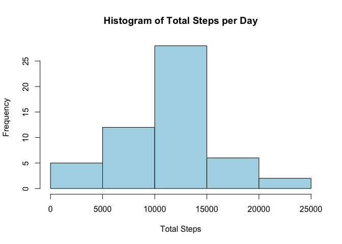
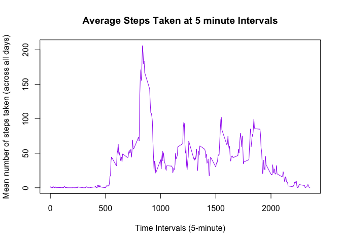
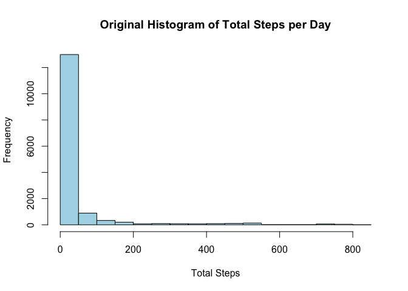
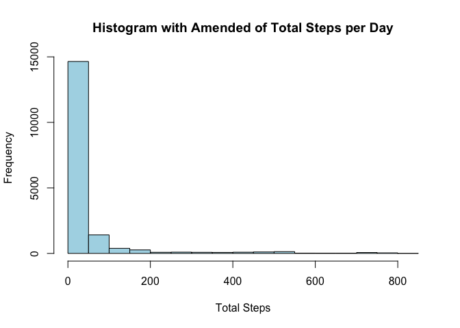
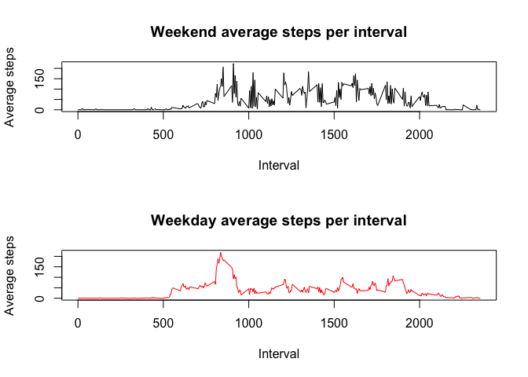

# Reproducible Research: Peer Assessment 1


## Loading and preprocessing the data

```r
activity<-read.csv ("activity.csv")

## convert date from factor to a date
activity$date <- as.Date(activity$date, "%Y-%m-%d")
## convert the interval to a factor
##activity$interval <- as.factor(activity$interval)
```
## What is mean total number of steps taken per day?

Get the total steps per day and then get the mean and median

```r
total_steps_per_day <- aggregate(steps~date,data=activity,sum,na.rm=TRUE)


mean_steps_per_day <- aggregate(steps~date,data=activity,mean,na.rm=TRUE)
median_steps_per_day <- aggregate(steps~date,data=activity[activity[, "steps"]> 0, ],median,na.rm=TRUE)
```

    
Show a histogram of the total steps per day

```r
hist(total_steps_per_day$steps, col="light blue", xlab= "Total Steps",
     ylab = "Frequency",main = "Histogram of Total Steps per Day")
```

 
## What is the average daily activity pattern?

Get the mean steps for interval

```r
 interval_mean<- tapply(activity$steps,activity$interval,mean,na.rm=TRUE)
```
Now plot the five minute interval and mean of steps, across all days

```r
plot(row.names(interval_mean),interval_mean,type="l",
     xlab="Time Intervals (5-minute)", 
     ylab="Mean number of steps taken (across all days)", 
     main="Average Steps Taken at 5 minute Intervals",
     col="purple")
```

 
Now find the interval which has max number of mean steps

```r
max_interval <- which.max(interval_mean)
interval_max_steps <- names(max_interval)
```
## Imputing missing values
Get the number of missing values

```r
missing_values <-(is.na(activity$steps))
sum(missing_values)
```

```
## [1] 2304
```

Create a new dataset and populates missing steps values for intervals, use mean steps for interval across all days, for those intervals that have missing values.  

```r
missing_steps<-activity[is.na(activity$steps),]

colnames(missing_steps)[colnames(missing_steps)=="steps"] <- "steps_new"
missing_steps$steps_new<-interval_mean
# merge the dataframe that has mean steps for intervals with missings steps back with the original 
# dataframe
amemded_activity<-merge(activity,missing_steps,by.x=c("date", "interval"), by.y=c("date", "interval"),all.x = TRUE)

# coalescle the step values
amemded_activity$steps<-ifelse(is.na(amemded_activity$steps),amemded_activity$steps_new,amemded_activity$steps)

# remove the new steps
amemded_activity<- amemded_activity[,1:3]

# plot origian dataframe and new non-empty dataframe
hist(activity$steps, col="light blue", xlab= "Total Steps",
     ylab = "Frequency",main = "Original Histogram of Total Steps per Day")
```

 

```r
hist(amemded_activity$steps, col="light blue", xlab= "Total Steps",
     ylab = "Frequency",main = "Histogram with Amended of Total Steps per Day")
```

 


## Are there differences in activity patterns between weekdays and weekends?
The weekday average peaks slightly higher in intervals 750 to 1000, but overall weekend averages are higher.

```r
amemded_activity["weekday"]<-weekdays(amemded_activity$date)

weekend_activity <- amemded_activity[amemded_activity$weekday == c("Saturday","Sunday"),]
weekday_activity <- amemded_activity[amemded_activity$weekday != c("Saturday","Sunday"),]

weekend_steps <- aggregate(weekend_activity$steps, by=list(weekend_activity$interval), FUN=mean) 
weekday_steps <- aggregate(weekday_activity$steps, by=list(weekday_activity$interval), FUN=mean) 

par(mfrow=c(2,1))

plot( x=weekend_steps[,1], 
      y=weekend_steps[,2], 
      type="l",
      main="Weekend average steps per interval",
      ylab="Average steps", 
      xlab="Interval")

plot( x=weekday_steps[,1], 
      y=weekday_steps[,2], 
      type="l",
      col=554,
      main="Weekday average steps per interval",
      ylab="Average steps", 
      xlab="Interval")
```

 
